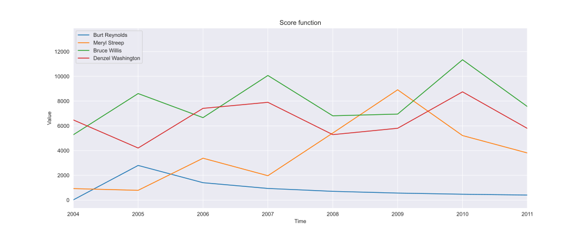
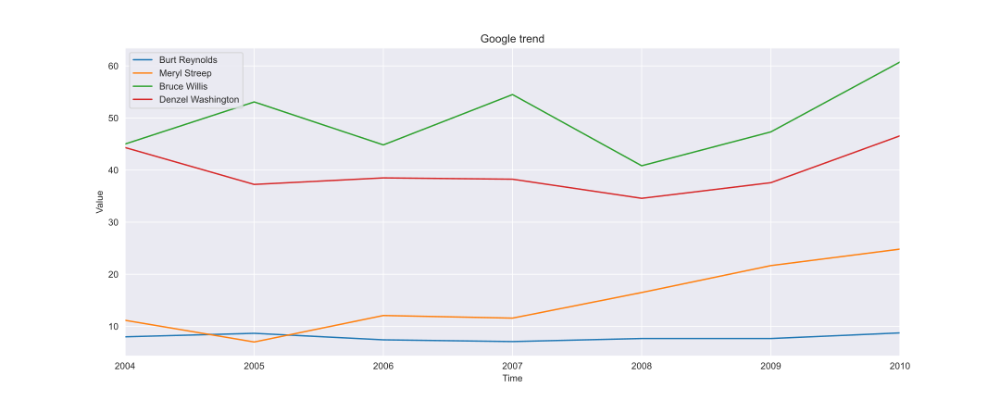

---
# Feel free to add content and custom Front Matter to this file.
# To modify the layout, see https://jekyllrb.com/docs/themes/#overriding-theme-defaults

layout: home
title: Homepage
heading: Road to being a star !
subheading: ""
banner: "/assets/images/banners/hwbanner.jpg"
---

# New in the Hollywood industry? Here's how to make it to the top!

You just got your first background character role, and you’re wondering how you should play your move to become 
Hollywood’s most famous actor or actress? Then you stumbled on the right website: in the following sections, we’ll 
show you how to organize your career, who to play with, what kind of film to star in and other tricks to boost your 
popularity to the top!

# Definitions

## Fame definition

Throughout these tips supported by analysis, we had to make some choices, one of them (and not the least) being the definition of fame. This will be the main metric throughout this analysis. When can we say that you are a Hollywood star? While the philosophical answer to this question is out of the scope of this analysis, we find a numerical way to describe it. The website [The Numbers](https://www.the-numbers.com/box-office-star-records/domestic/yearly-acting/) provides a yearly ranking of a few hundred actors and actresses. In “The Numbers”, the movies are ranked following the US Box Office and actors starring in the highest BO movies get a higher score.

This metric follows the idea that when an actor has played in a movie that generated a large BO, the movie has a lot of visibility therefore the fame of the cast is increased. 

## Direction taken, technical details

In this section, we will explain the different "strategic" choices we have made both on the dataset and on the way our metric is used.
The first choice is to take only films from the US because they represent a little more than 40% of the movies in the database which is substantial, and also our metric is based on the US box office. A second choice was to group movies by lustrums (1 lustrum = 5 years). This choice will make sense with the following explanation.
As a reminder, our metric assigned a score to actors who appeared in a film that made it into the top 100 US BO. Every actor has a new feature assigned to him·her and three states are possible: “unknown”, “is revealed” and “famous”. When you are in a movie and you are not yet famous you keep the “unknown” status. The status becomes "is revealed" the first year the actor·ress has a score. The status "is revealed" is kept for the whole lustrum in which the revelation took place. The status "famous" is reached automatically at the next lustrum.

After some analysis, this score is missing something, it’s missing the history of the actor·ress. To take into account the entire career of an actor·ress his·her score has been adjusted with the length of his·her career and the number of movie he·she starred in, with a decay over time.
This new way to find the score has been compared to the Google trends tool. The results seen in the figures below show the resemblance between our score functions curves and google trends curves for a few different actors.

We also used a PCA to decrease the number of genres by 95%, for the analysis to be more convenient. 

# What now?

Now we have a basis on the metric for fame, we will be able to give you tips and tricks to climb to the top of Hollywood fame. But how? We will first have a look at the attributes of movies that have a revelation, as well as attributes of actors·resses when they are revealed (//TODO: est-ce qu'on fait ce dernier truc ou pas ?). Then we will look at which actors·resses boosted others to give you advice about the cast. We will also show be an analogy with epidemies and how graphs evolve. Then we will give you hints on what to do once you become famous, and how to stay famous. Finally, we will predict who you should play with based on your attributes, to maximise your chances to become famous right now.

# What kind of films will make you famous?

Doing a logistic regression on all movies, here are the attributes that contributed the most (and the least) towards revealing at least an actor. We can see that ATTRIBUTE_1 has a high positive impact, meaning the more ATTRIBUTE_1 a movie has, the more likely it is to create a revelation. On the contrary, ATTRIBUTE_99 has a high negative impact, meaning you should avoid a movie that has a high ATTRIBUTE_99. ATTRIBUTE_50 however has close to no effect, no particular advice about this attribute.
With this, we can already come up with a few tips on what to prioritize and what to avoid. Go for ATTRIBUTE_1, ATTRIBUTE_2, ATTRIBUTE_3 movies, they will maximise your chances to become famous, and avoid ATTRIBUTE_99, ATTRIBUTE_98, ATTRIBUTE_97, they will negatively impact your likelihood to become famous.

super graph-escalier qui arrive :)) Avec une petite analyse rapide de l'histoire hein :))
On parle aussi ici du fait qu'il faut jouer dans des films de comédie non ?

# Who are the career boosters?

Let’s start with its definition. A career booster is an actor·ress that has the “famous” state for a given lustrum and has co-acted with a “is revealed” actor·ress during that lustrum. The graph presents the career boosters for a given lustrum and for a given PCA genre with the y-axis being the (degree centrality  / betweeness centrality).
In our model, this centrality represents the /[explain the right centrality/].
//TODO: Describing stuff, what is shown on the graph, etc...

    

        <select id="s_year" onchange="update_current_hist()"></select>
        <select id="s_genre" onchange="update_current_hist()"></select>
    

    <iframe id="hist_booster">No available data</iframe>
    
No data for given selection

On peut dire que most ces acteurs c'est pas iron man mais plustot que'est-ce qu'on a fait au bon dieux / 
le père noel est une ordure. Ou the mask.

# Fame seen as an epidemy
We could see that acting with famous people will help you become famous. This simple fact reminds us another kind of network phenomenon, contagion. How close is it from a illness contagion, aka an epidemy?
//TODO: mettre le GIF que James est en train de faire <3
//TODO: maybe ajouter un GIF d'un modèle SIR pour la comparaison ?
Jsp si c'est faisable en vrai, faut vrm qu'on se penche là dessus. need stuff to generate NX graph, I'll make it 
interactive later.

# How to stay on top ?
An interesting thing to see is how do some attributes of your next movie change with regard to the movie that made you famous. Here is a "ladder" graph, just like our regression from before. This changed, this changed, this stayed the same. //TODO: ajouter les trucs

## 15 years later, what do you do?
//TODO: Pas full sûr de cette section, on peut la tej en vrai

# Now it's your turn
Ok, now tell us who you are, and we tell you how likely you would have been famous shooting with some people in 2013.

    

        
 <label for="age">Age: </label> 

        
<input type="number" id="age" min="0" value="25"/> 

    
 
    

        
<label for="total_actors">Casting size excluding you:</label>

        
<input type="number" id="total_actors" min="1" value="5"/>

    

    

        
 Sex: 

        
         
            

              <input type="radio" id="gender" name="drone" value="1" checked />
              <label for="gender">Woman</label>
            

            

              <input type="radio" id="is_male" name="drone" value="0" />
              <label for="is_male">Man</label>
            

        

    

    

        

            <label for="actor1">Famous actor 1</label>
        

        
 
            <select id="actor1"> </select>    
        

    

    

        

            <label for="actor2">Famous actor 2</label>
        

        

            <select id="actor2"></select>  
        

    

    

        

            <label for="actor3">Famous actor 3</label>
        

        

            <select id="actor3"></select>  
        

    

    

        

            <label for="actor4">Famous actor 4</label>
        

        

            <select id="actor4"></select>  
        

    

    

        

            <label for="actor5">Famous actor 5</label>
        

        

            <select id="actor5"></select>  
        

    

    

        <button id="button_predict" onclick="predict_score()" class="nice_button">Make me famous !</button> 
    

    

# Results
Here are the main results we were able to make in our analysis:

# Conclusion
Throughout this project, we did this and that.

<link rel="stylesheet" href="assets/css/custom.css"/>
