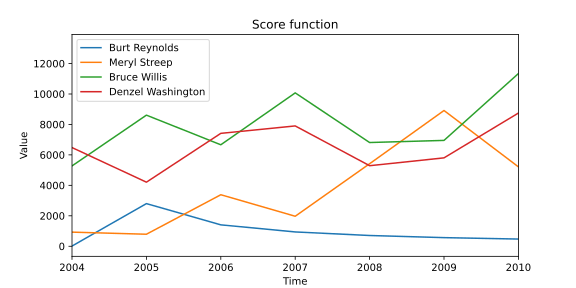

---
# Feel free to add content and custom Front Matter to this file.
# To modify the layout, see https://jekyllrb.com/docs/themes/#overriding-theme-defaults

layout: home
title: Homepage
heading: Road to being a star!
subheading: ""
banner: "/assets/images/banners/hwbanner.jpg"
---
<link rel="stylesheet" href="assets/css/custom.css"/>

# New in the Hollywood industry? Here's how to make it to the top!

You just got your first background character role, and you’re wondering how you should play your moves to become 
Hollywood’s most famous actor or actress? Then you stumbled on the right website: in the following sections, you’ll 
learn to organize your career, who to play with, what kind of film to star in and other tricks to boost your 
popularity to the top!

## Fame definition

When can somebody be considered a Hollywood star? The philosophical answer to this question is out of the scope 
of this analysis. However, we decided to use a numerical value downloadable from 
[The Numbers](https://www.the-numbers.com/box-office-star-records/domestic/yearly-acting/). Their ranking is based on 
the Box-Office revenue (BOR) of the films each actor played in during the past three years.

This metric follows the idea that when an actor has played in a movie that generated a large BOR, the movie has a lot 
of visibility which increases the fame of the cast. 

We group movies by lustrum (1 lustrum = 5 years) to ease comparisons and for better visualisation purposes. We define
'becoming famous' as the first lustrum in which you appear in _The Numbers_, after which you are considered famous for 
the rest of your life. We also added a weight decaying over time, to represent that a recent high BOR movie will have a
greater impact on your fame than an old movie.

We compare our metric with Google Trends to check whether it is suitable, below is a graph comparing a few 
actors·resses.

 

# Roadmap

Now that we have a basis on the metric for fame, we will be able to give you tips and tricks to reach the top of the Hollywood
food chain. But how? We will first have a look at the attributes of movies that have a revelation, as well as attributes of 
actors·resses when they are revealed. Then we will look at which actors·resses boosted others to give you advice about 
the cast. We will also show how important it is to stay strongly connected to other actors. Then we will give you hints on what to 
do once you become famous, namely how to stay famous. Finally, we will predict who you should play with based on your 
attributes, to maximise your chances to become famous.

# What kind of films will make you famous?

The first thing to say is that you should start with films that have the biggest audience. Comedy or action films are, 
as shown on the graph below, the 2 most appropriate genres, regardless of whether you're a man or a woman.

Now, let's perform a logistic regression on all movies to have a better idea of what attributes contribute most to 
revealing actors and actresses. The graph on the left shows the paramters that help actors become famous, and on the 
right we can see how these parameters evolved in the second film after an actor·ress revelation. This way you know what
to focus on to become famous, but also what you should pay attention to when preparing your next movie.

We can see that coacting with a cast having a high score will negatively affect your probability of 
becoming famous. This is an interesting fact, one could think that playing with a famous cast would reveal you’re 
actually shadowed by it !

### Becoming famous
We can see that ATTRIBUTE_1 has a high positive impact, meaning the more ATTRIBUTE_1 a movie has, the more likely it is to create a revelation. On the contrary, ATTRIBUTE_99 has a high negative impact, meaning you should avoid a movie that has a high ATTRIBUTE_99. ATTRIBUTE_50 however has close to no effect, no particular advice about this attribute.
With this, we can already come up with a few tips on what to prioritize and what to avoid. Go for ATTRIBUTE_1, ATTRIBUTE_2, ATTRIBUTE_3 movies, they will maximise your chances to become famous, and avoid ATTRIBUTE_99, ATTRIBUTE_98, ATTRIBUTE_97, they will negatively impact your likelihood to become famous.

### Now that I am famous, how shall I choose my next perfomance?
Based on the graph on the right, it is clear that the strategy to adopt is not the same. Some features remain important, some change drastically. Here are some of the main changes:
* The most important ATTRIBUTE_1 is even more important now, you should really try to maximise it.
* We can note ATTRIBUTE_QUI_DEVIENT_TREEES_NEGATIF to really avoid now that you’re famous.
* ATTRIBUTE_QUI_DEVIENT_2E_+_IMPORTANT was to avoid is possible, it is now the second most important, don't forget to change that
* Same vibe for ATTRIBUTE_QUI_DEVIENT_4E_+_IMPORTANT

# Who are the career boosters?

Let’s start with definitions:
* A **career booster** is an actor·ress that is already famous during a given lustrum and has co-acted with an actor·ress 
that has been revealed during that lustrum.
* The **degree centrality** is defined as the number of links incident upon a node. In this analysis the nodes are actors 
and the links (also called edges) are the films that link two actors.

By selecting the lustrum and the PCA genre in the dropdown buttons below, actors with the highest degree centrality for 
a given lustrum and PCA genre are displayed. By hovering over the bars, different attributes of this _career booster_ 
are displayed.

    

        <label for="s_year"></label><select id="s_year" onchange="update_current_hist()"></select>
        <label for="s_genre"></label><select id="s_genre" onchange="update_current_hist()"></select>
    

    <iframe id="hist_booster">No available data</iframe>
    
No data for given selection

# How does fame evolve over time ?
Let’s guide you through the following animation. The subset of films having the PCA genre _Thriller, Crime Thriller,
Action, Mystery_ is taken to lighten the graph and help visualize what’s happening.  The nodes represent the actors and 
actresses and the films connecting those actors are the edges. Nodes change color according to the popularity of the 
actor for a given year.

The nodes are at first invisible. When the actor·ress playes his·her first film, the nodes becomes grey. A node then  
becomes orange upon becoming famous. The year after the node becomes red since he·she is famous.
It is interesting to see that a lot of revelations start directly in orange meaning that they are revealed in their 
first movie! A second observation is that the heart of the graph is very strongly connected, which emphasizes 
the importance of networking in this industry.

    

# Now it's your turn
Year is 2013. You don't know it yet, but you belong to the set of people that are made to be a star. We provide you 
this tool in order for you to estimate how good a film could be for your career given its casting. 

    

        
 <label for="age">Age: </label> 

        
<input type="number" id="age" min="0" max="115" value="25"/> 

    
 
    

        
<label for="total_actors">Casting size excluding you:</label>

        
<input type="number" id="total_actors" min="1" max="20" value="5"/>

    

    

        
 Sex: 

        
         
            

              <input type="radio" id="gender" name="drone" value="1" checked />
              <label for="gender">Woman</label>
            

            

              <input type="radio" id="is_male" name="drone" value="0" />
              <label for="is_male">Man</label>
            

        

    

    

        

            <label for="actor1">Famous actor 1</label>
        

        
 
            <select id="actor1"> </select>    
        

    

    

        

            <label for="actor2">Famous actor 2</label>
        

        

            <select id="actor2"></select>  
        

    

    

        

            <label for="actor3">Famous actor 3</label>
        

        

            <select id="actor3"></select>  
        

    

    

        

            <label for="actor4">Famous actor 4</label>
        

        

            <select id="actor4"></select>  
        

    

    

        

            <label for="actor5">Famous actor 5</label>
        

        

            <select id="actor5"></select>  
        

    

    

        <button id="button_predict" onclick="predict_score()" class="nice_button"> Worth a shot? </button> 
    

    

# Conclusion
The take home advices to become famous is that it's important to stay connected to famous people. However, you may stay
in the shadow of the too famous ones, hence don't go for a movie where the star of the show is way out of your league. 
Finally, aim for a comedy or an action film, and don't loose hope if you don't make it after your first film, as the
second one might be the good one.

